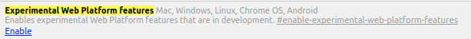

# Looks like you still haven't activated the FaceDetector API

## Follow these instructions

### Copy and paste this into a new tab

```shell
chrome://flags/#enable-experimental-web-platform-features
```

### And enable the experimental web platform features



### After enabling it you should see a **Relaunch Now** button on the bottom of the screen.


### Relaunch the browser please.
